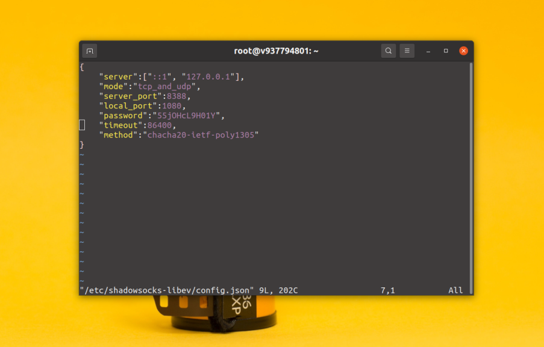
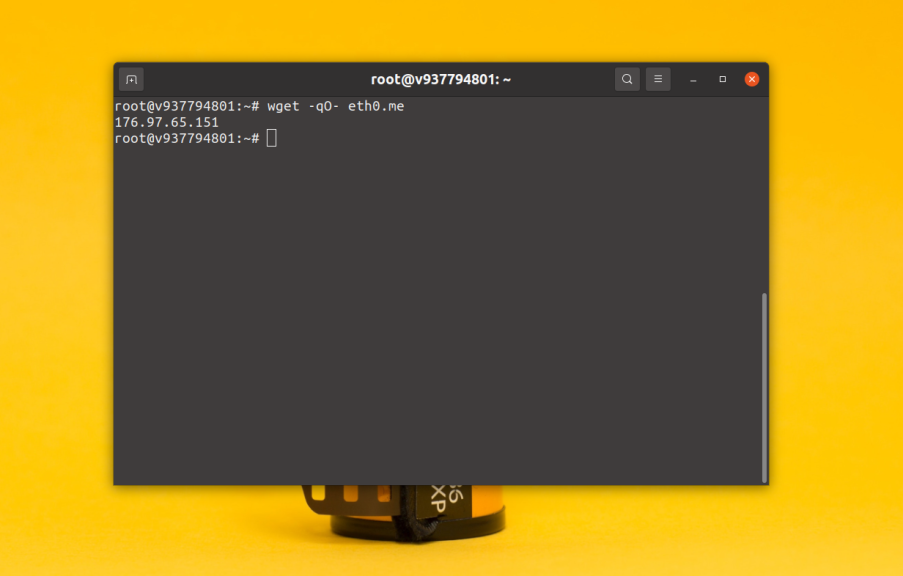

```sh
sudo apt update
```

## Установка Shadowsocks из репозитория

Реализация shadowsocks на Си есть в официальных репозиториях Ubuntu. Вы можете установить её с помощью команды:

```sh
sudo apt install shadowsocks-libev
```
## Настройка shadowsocks

Конфигурационный файл shadowsocks находится по пути **/etc/shadowsocks-libev/config.json** и по умолчанию выглядит вот так:



Вот что означают эти сроки:

- **server** - IP адрес, на котором программа будет ожидать соединений, должно соответствовать внешнему IP адресу вашего сервера.
- **mode** - указывает какой протокол соединение использовать - tcp, udp или оба.
- **server_port** - порт сервера, который вы будете использовать для подключения, по умолчанию - 8388.
- **local_port** - порт клиента, к которому будет подключаться браузер по протоколу SOCS5.
- **password** - пароль, который будет использоваться клиентами для подключения.
- **timeout** - время, через которое отключат пользователя при его бездействии.
- **method** - метод шифрования, по умолчанию используется **chacha20-ietf-poly1305**, но я поставлю **aes-256-cfb**.

Для начала работы с shadowsocks надо установить в поле **server** внешний IP адрес вашего сервера. Его можно посмотреть командой:

`wget -qO- eth0.me`



Также в поле password, надо прописать пароль, который будет использоваться на клиенте для подключения к серверу. Всё остальное можно оставить по умолчанию. После внесения изменений конфигурационный файл может выглядеть вот так:

`sudo vi /etc/shadowsocks-libev/config.json`

```sh
{
	"server": "176.97.65.151",
	"mode":"tcp_and_udp",   
	"server_port":8388,   
	"local_port":1080,   
	"password":"55jOHcL9H01Y",   
	"timeout":3600,   
	"method":"aes-256-cfb"   }
```

Также после внесения изменений в конфигурационный файл необходимо перезапустить сервис:

`sudo systemctl restart shadowsocks-libev`
